# AroioRC for Android

    

This Project is under construction and is open for contributions.
The goal of the project is explained below. 
Afterwards all screens are shown and explained in detail.

## Goal
This is the open source project for the Android app of the AroioRC.
The goal of this application is to configure the AroioOS by a native UX.
At initial start the user gets displayed all available devices running with AroioOS.
The user has to choose the device to configure and needs to login.
After login several configurations can be modified.

## Screens

### Login screen
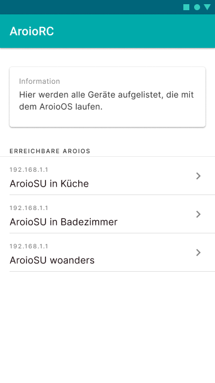  
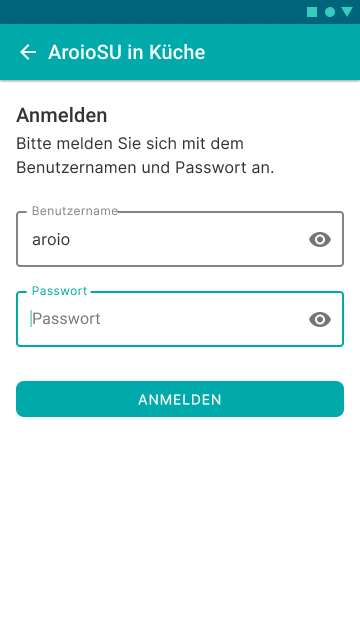

After selecting the device to configure, a login screen should be displayed. 
When correct username and password are set, the detail screens are accessible.
The detail screen of an Aroio device is divided into multiple tabs in a bottom navigation.

### Configuration Tab
The first tab is used for general configurations of the device.

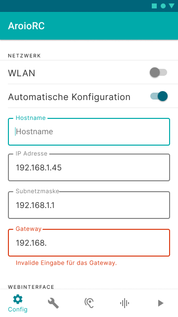
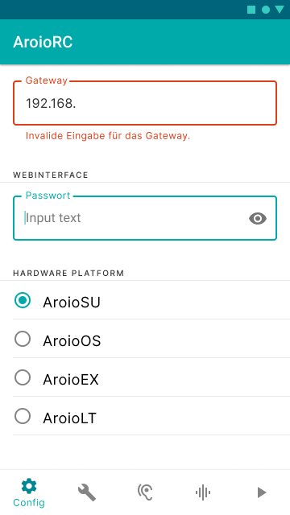

### System Tab
The second tab is used for displaying information about the system and the possibility to update the AroioOS.

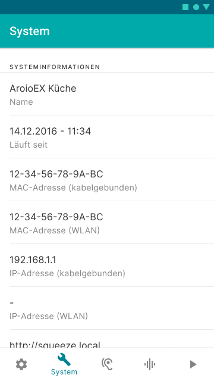
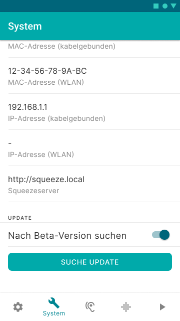

### Convolver Tab
The convolver tab is storing all the filters the user has added to the AroioOS.
The user can also activate or deactivate the convolver as well as activate or deactivate loading a pre-filter on boot.

    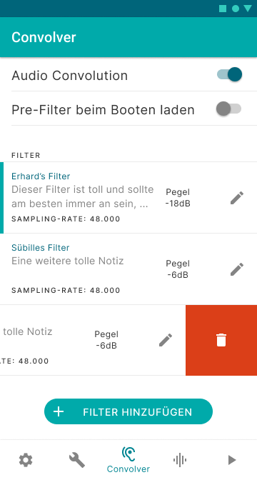

When the user wants to edit an existing filter, a bottom sheet shall be displayed with all editable fields of a filter.

    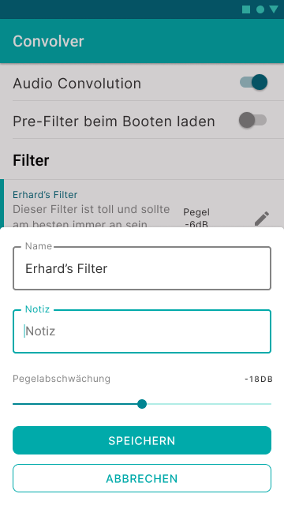

#### Adding a new filter
When a new filter is added, the user is guided through a process with the following steps: 

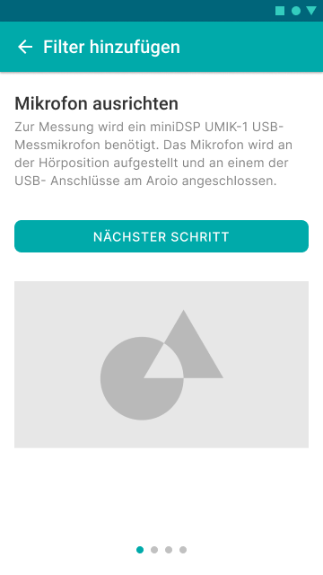 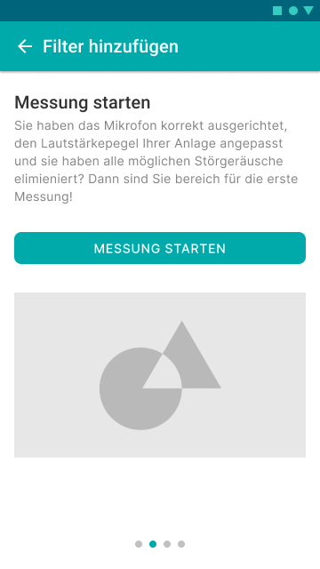 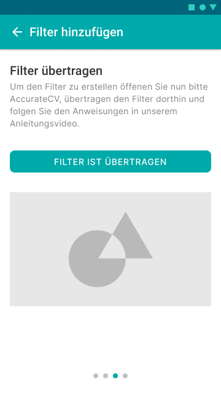 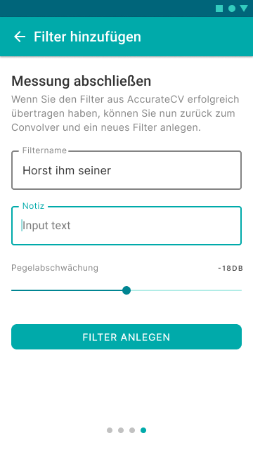

The first explains how to setup a usb microphone for a measurement.
When the user is done the next step can be started.
The second steps explains how the measurement is working and the user can start it manually.
When the user has started the measurement, a bottom sheet shall display the current state.
Also the user should have the opportunity to cancel the measurement.

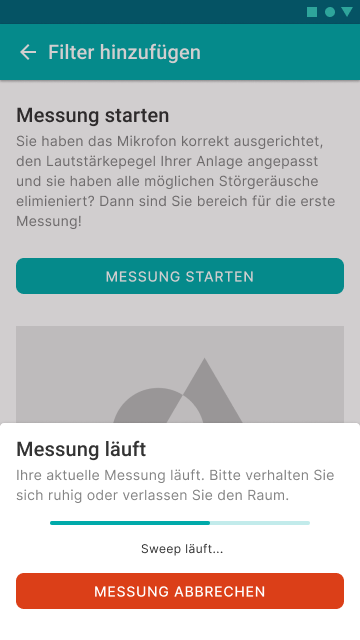

For the third step the user has to use a [software by AudioVero](https://www.audiovero.de/acourateconvolver.php).
When the filter is setup the user can go further to step 4.
In step 4 the user sets a name, an optional note and the level reduction.

In the case the user wants to cancel the process an alert should be displayed.

    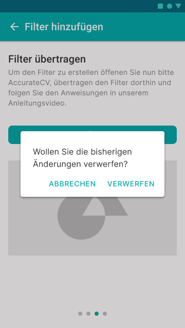

### Audio Tab
The audio tag should configure the output patching of the AroioOS.

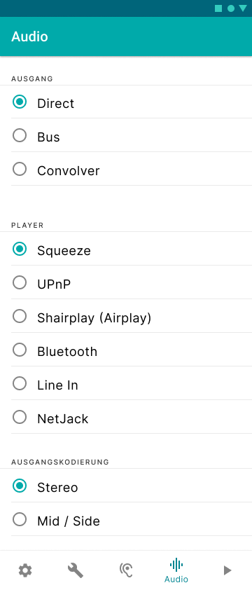 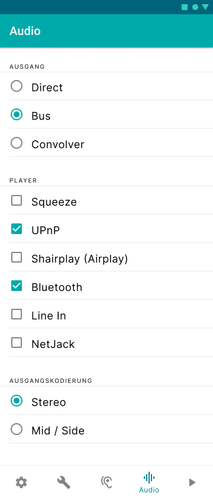 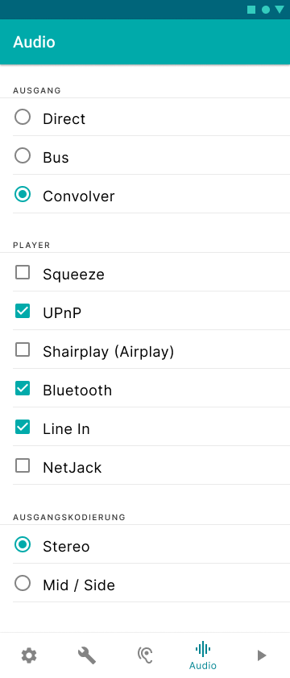

For the direct output, the user can only select a single player.
For the bus output and the convolver output the user can select multiple players.
The output encoding is always stereo or mid / side.

### Streaming Tab
Currently only an idea of what the app also could handle.
So therefor no designs are made. 